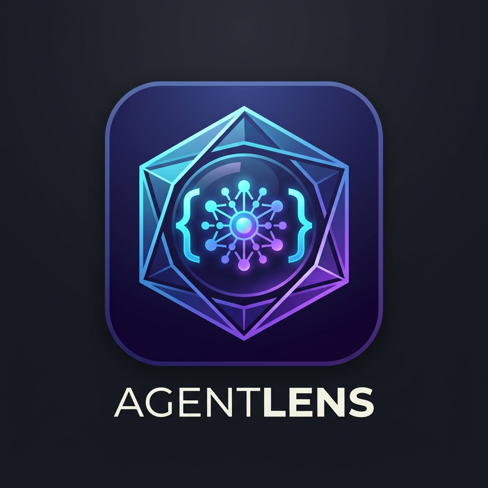

  

<h1 align="center">AgentLens</h1>

  <strong>A unified lens to search, inspect, and export conversation history across AI coding agents in VS Code.</strong>

  <a href="#-supported-agents">Supported Agents</a> •
  <a href="#-features">Features</a> •
  <a href="#️-shortcuts--commands">Shortcuts</a> •
  <a href="#️-architecture">Architecture</a>

---

## 🌟 Supported Agents

| Agent | Status | Supported Path / Format |
| :--- | :---: | :--- |
| **OpenAI Codex** | ✅ Supported | `~/.codex/sessions/` (JSONL rollouts & threads) |
| **OpenCode** | 🔜 Planned | `~/.local/share/opencode/` |
| **AGY (Antigravity)** | 🔜 Planned | `~/.gemini/antigravity-cli/brain/` |
| **Claude Code** | 🔜 Planned | `~/.claude/sessions/` |

---

## ✨ Features

- 🔍 **Real-Time Full-Text Search (`Ctrl + Alt + F` / `Cmd + Alt + F`)**
  - Search across **User Inputs**, **Agent Thinking Processes**, and **Assistant Responses**.
  - Clearly tags match categories (`[用户输入]`, `[思考过程]`, `[回答输出]`) with contextual previews.

- 🎯 **Precise Jump & Highlight**
  - Selecting any search result immediately opens the conversation document, scrolls the editor directly to the matching line, and highlights the keyword.

- 🧼 **Boilerplate-Free Clean Markdown**
  - Automatically filters internal framework prompts, `AGENTS.md` injected templates, and noisy empty tool call frames.
  - Generates clear, readable sections:
    - 👤 `## 👤 用户输入 (User)`
    - 💭 `> 💭 思考过程 / 行动前述`
    - 🤖 `## 🤖 回答输出 (Response)`

- 📂 **Dual Sidebar Views**
  - Browse historical sessions by update time in both the **Activity Bar (AgentLens)** and the **Explorer (File Tree)** panel.

- 🚀 **Workspace Sync for Native `Ctrl + Shift + F`**
  - Export all sessions as clean `.md` files into `.agentlens-history/` in your workspace, allowing VS Code's native global search to index all agent dialogues.

---

## ⌨️ Shortcuts & Commands

| Shortcut / Command | Action |
| :--- | :--- |
| `Ctrl + Alt + F` (Mac: `Cmd + Alt + F`) | **Search Agent History**: Global real-time dialogue search |
| `AgentLens: Export All Chats to Workspace` | Export all sessions to workspace for native global search |
| `AgentLens: Refresh History` | Reload and refresh the conversation list |

---

## 🏗️ Architecture

- Built as a lightweight, zero-dependency VS Code extension.
- Uses VS Code's native `TextDocumentContentProvider` (`agentlens:/chat/<id>.md`) for memory-efficient virtual Markdown rendering.
- Extensible multi-agent parser architecture designed to support disparate local session formats seamlessly.
